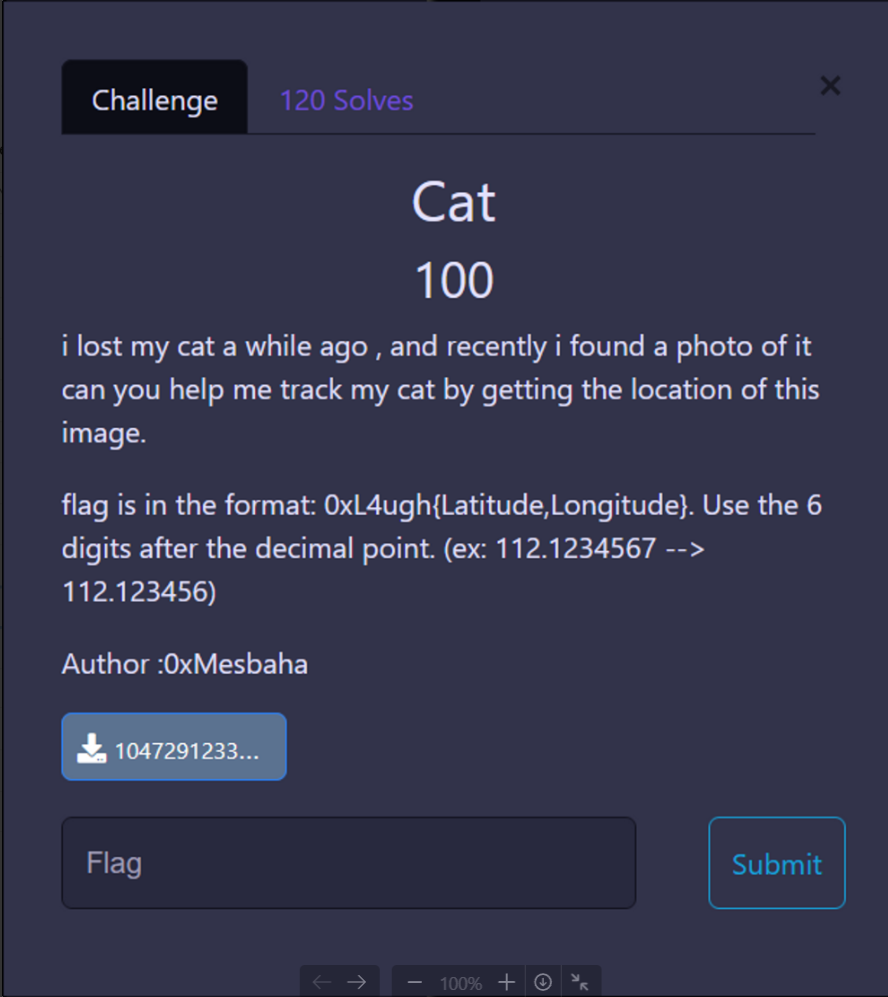
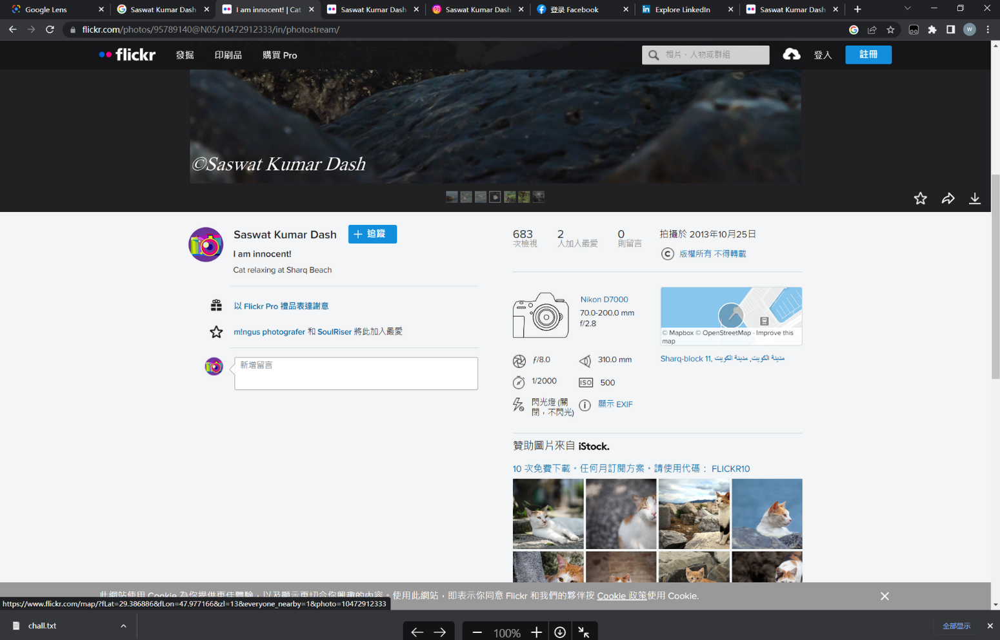
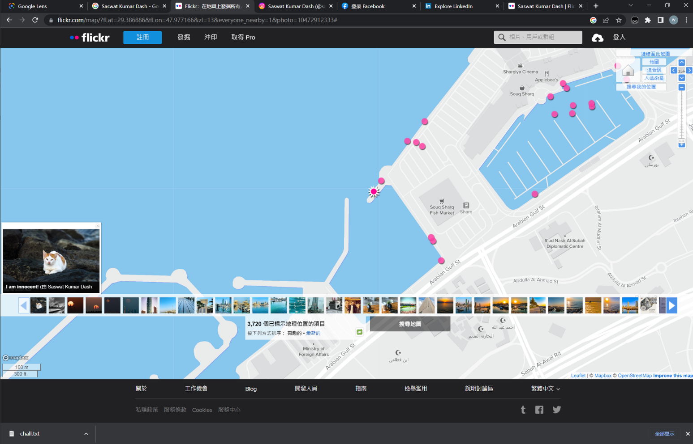

# Cat

google图片（得到大致猫的品种）土耳其品种

google图中文字

可以看到相关照片

往下看到照片的详细信息

点开地图选择图片并进入地图放到最大（其实不需要放大。。）

码头附近，应该没毛病，经纬度结果藏在url里。

https://www.flickr.com/map/?fLat=29.386886&fLon=47.977166&zl=13&everyone_nearby=1&photo=10472912333

**0xL4ugh{29.386886,47.977166}**
