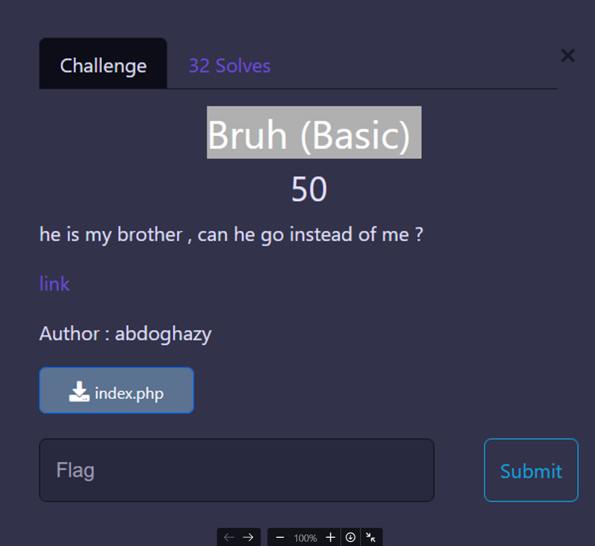
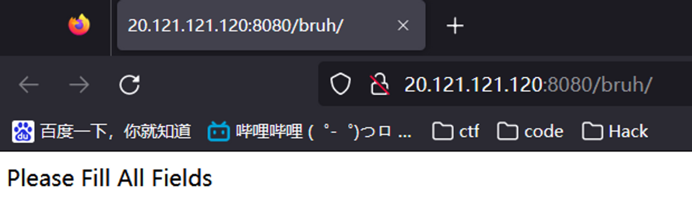
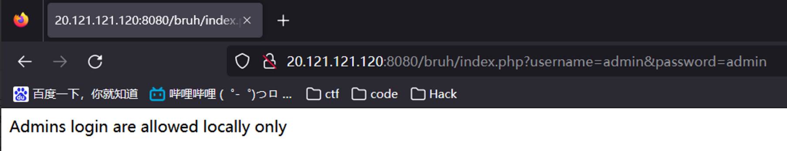
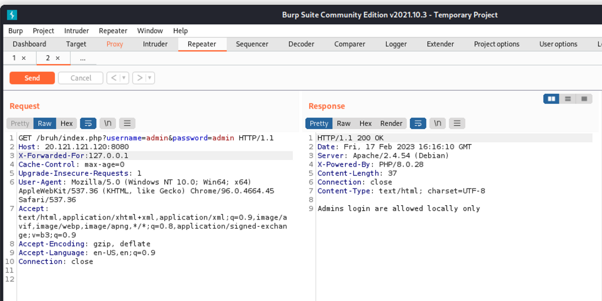
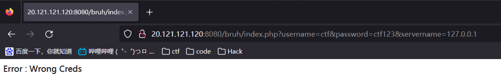
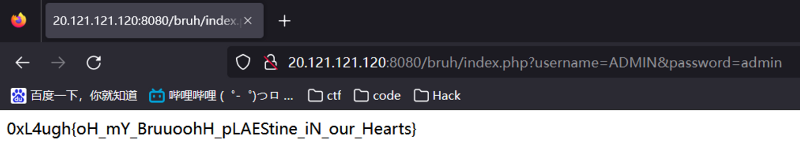

# Bruh(Basic)



```php
<?php

$servername = "127.0.0.1";
$username = "ctf";
$dbname = "login";
$password = "ctf123";

// Create connection
$conn = new mysqli($servername, $username, $password,$dbname);

// Check connection
if ($conn->connect_error) {
    die("Connection failed: " . $conn->connect_error);
}

if(!empty($_GET['username']) && !empty($_GET['password']))
{
    $username=mysqli_real_escape_string($conn,$_GET['username']);
    $password=mysqli_real_escape_string($conn,$_GET['password']);
    if ($username=="admin" && $_SERVER['REMOTE_ADDR']!=="127.0.0.1")
    {
        die("Admins login are allowed locally only");
    }
    else
    {
        $res=$conn->query("select * from users where username='$username' and password='$password'"); # admin admin
        if($res->num_rows > 0)
        {
            $user=$res->fetch_assoc();
            echo ($user['username']==="admin")?"0xL4ugh{test_flag}":"sorry u r not admin";
        }
        else
        {
            echo "Error : Wrong Creds";
        }

    }
}
else
{
    echo "Please Fill All Fields";
}
?>
```



```
/index.php?username=admin&password=admin
```



改下X-Forwarded-for没用。。



fakeip也没用。。


改username和password为开头的ctf和ctf123



仔细观察可能127.0.0.1这个条件是无法满足的，只能让php中username不为admin但在sql查询语句中username仍为admin

通过查阅资料可知php判断username没有加/i是区分大小写的，所以
```php
if ($username=="admin" && $_SERVER['REMOTE_ADDR']!=="127.0.0.1")
```


**0xL4ugh{oH_mY_BruuoohH_pLAEStine_iN_our_Hearts}**