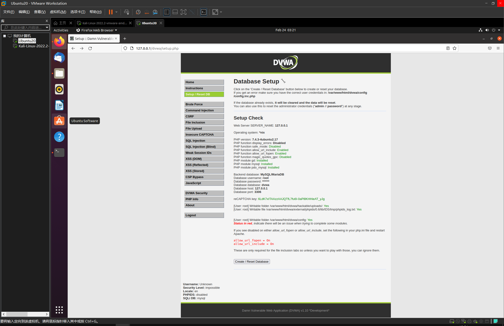
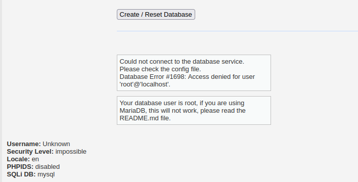
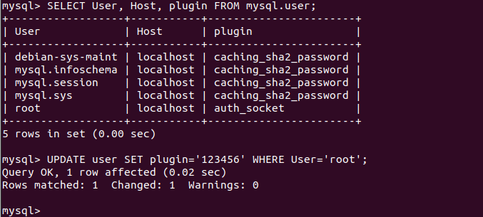
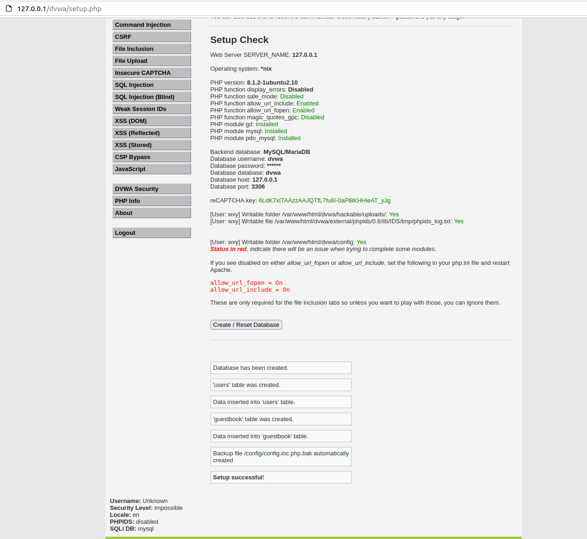

# DVWA
## 配置


dvwa/config/config.inc.php
```
# ReCAPTCHA settings
#   Used for the 'Insecure CAPTCHA' module
#   You'll need to generate your own keys at: https://www.google.com/recaptcha/admin
$_DVWA[ 'recaptcha_public_key' ]  = '6LdK7xITAAzzAAJQTfL7fu6I-0aPl8KHHieAT_yJg';
$_DVWA[ 'recaptcha_private_key' ] = '6LdK7xITAzzAAL_uw9YXVUOPoIHPZLfw2K1n5NVQ';

```
```
# Database variables
#   WARNING: The database specified under db_database WILL BE ENTIRELY DELETED during setup.
#   Please use a database dedicated to DVWA.
#
# If you are using MariaDB then you cannot use root, you must use create a dedicated DVWA user.
#   See README.md for more information on this.
$_DVWA = array();
$_DVWA[ 'db_server' ]   = '127.0.0.1';
$_DVWA[ 'db_database' ] = 'dvwa';
$_DVWA[ 'db_user' ]     = 'root';
$_DVWA[ 'db_password' ] = '123456';
$_DVWA[ 'db_port'] = '3306';
```
dvwa/php.ini
```
; This file attempts to overwrite the original php.ini file. Doesnt always work.

magic_quotes_gpc = Off
allow_url_fopen = on
allow_url_include = on
```
配置截图

```
wangxuyang@ubuntu:~$ ifconfig
ens33: flags=4163<UP,BROADCAST,RUNNING,MULTICAST>  mtu 1500
        inet 192.168.231.130  netmask 255.255.255.0  broadcast 192.168.231.255
```
数据库连接有点问题



配置完成截图
