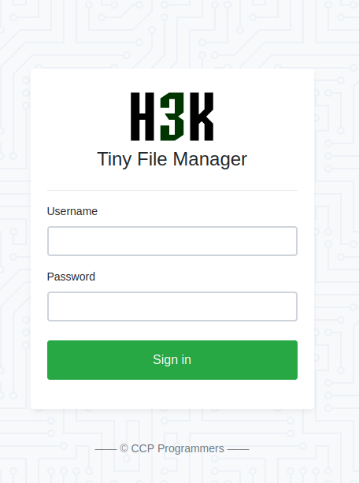
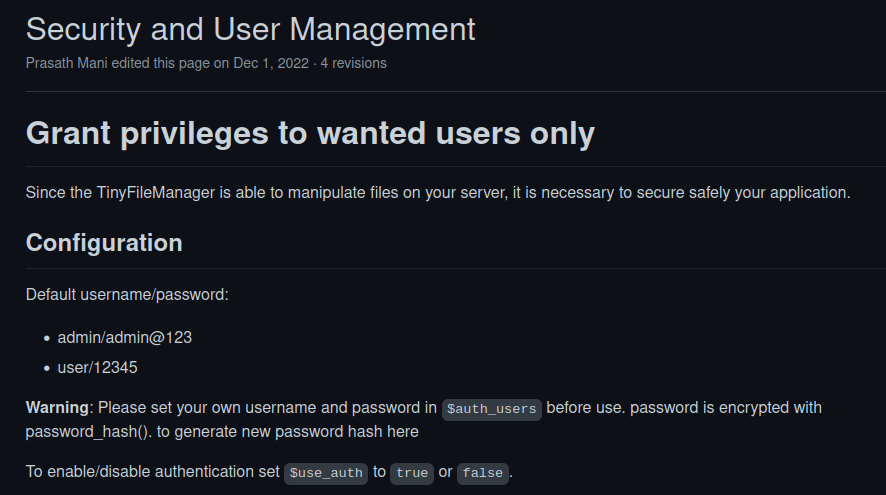
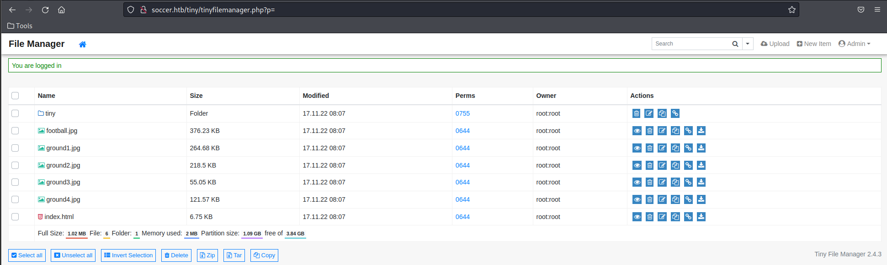

# Soccer

ip==10.10.11.194
tun0==10.10.11.194

```
┌──(kali㉿kali)-[~]
└─$ sudo nmap -sS -T4 -p- 10.10.11.194 -oN soccer.txt
[sudo] password for kali: 
Starting Nmap 7.92 ( https://nmap.org ) at 2023-02-23 07:36 EST
Nmap scan report for 10.10.11.194
Host is up (0.24s latency).
Not shown: 65532 closed tcp ports (reset)
PORT     STATE SERVICE
22/tcp   open  ssh
80/tcp   open  http
9091/tcp open  xmltec-xmlmail

Nmap done: 1 IP address (1 host up) scanned in 986.33 seconds
```
```
┌──(root㉿kali)-[/home/kali]
└─# nmap -sC -sV 10.10.11.194 -oN soccer.txt
Starting Nmap 7.92 ( https://nmap.org ) at 2023-02-23 08:47 EST
Nmap scan report for soccer.htb (10.10.11.194)
Host is up (0.24s latency).
Not shown: 997 closed tcp ports (reset)
PORT     STATE SERVICE         VERSION
22/tcp   open  ssh             OpenSSH 8.2p1 Ubuntu 4ubuntu0.5 (Ubuntu Linux; protocol 2.0)
| ssh-hostkey: 
|   3072 ad:0d:84:a3:fd:cc:98:a4:78:fe:f9:49:15:da:e1:6d (RSA)
|   256 df:d6:a3:9f:68:26:9d:fc:7c:6a:0c:29:e9:61:f0:0c (ECDSA)
|_  256 57:97:56:5d:ef:79:3c:2f:cb:db:35:ff:f1:7c:61:5c (ED25519)
80/tcp   open  http            nginx 1.18.0 (Ubuntu)
|_http-server-header: nginx/1.18.0 (Ubuntu)
9091/tcp open  xmltec-xmlmail?
| fingerprint-strings: 
|   DNSStatusRequestTCP, DNSVersionBindReqTCP, Help, RPCCheck, SSLSessionReq, drda, informix: 
|     HTTP/1.1 400 Bad Request
|     Connection: close
|   GetRequest: 
|     HTTP/1.1 404 Not Found
|     Content-Security-Policy: default-src 'none'
|     X-Content-Type-Options: nosniff
|     Content-Type: text/html; charset=utf-8
|     Content-Length: 139
|     Date: Thu, 23 Feb 2023 13:48:15 GMT
|     Connection: close
|     <!DOCTYPE html>
|     <html lang="en">
|     <head>
|     <meta charset="utf-8">
|     <title>Error</title>
|     </head>
|     <body>
|     <pre>Cannot GET /</pre>
|     </body>
|     </html>
|   HTTPOptions: 
|     HTTP/1.1 404 Not Found
|     Content-Security-Policy: default-src 'none'
|     X-Content-Type-Options: nosniff
|     Content-Type: text/html; charset=utf-8
|     Content-Length: 143
|     Date: Thu, 23 Feb 2023 13:48:18 GMT
|     Connection: close
|     <!DOCTYPE html>
|     <html lang="en">
|     <head>
|     <meta charset="utf-8">
|     <title>Error</title>
|     </head>
|     <body>
|     <pre>Cannot OPTIONS /</pre>
|     </body>
|     </html>
|   RTSPRequest: 
|     HTTP/1.1 404 Not Found
|     Content-Security-Policy: default-src 'none'
|     X-Content-Type-Options: nosniff
|     Content-Type: text/html; charset=utf-8
|     Content-Length: 143
|     Date: Thu, 23 Feb 2023 13:48:19 GMT
|     Connection: close
|     <!DOCTYPE html>
|     <html lang="en">
|     <head>
|     <meta charset="utf-8">
|     <title>Error</title>
|     </head>
|     <body>
|     <pre>Cannot OPTIONS /</pre>
|     </body>
|_    </html>
1 service unrecognized despite returning data. If you know the service/version, please submit the following fingerprint at https://nmap.org/cgi-bin/submit.cgi?new-service :
SF-Port9091-TCP:V=7.92%I=7%D=2/23%Time=63F76E9A%P=x86_64-pc-linux-gnu%r(in
SF:formix,2F,"HTTP/1\.1\x20400\x20Bad\x20Request\r\nConnection:\x20close\r
SF:\n\r\n")%r(drda,2F,"HTTP/1\.1\x20400\x20Bad\x20Request\r\nConnection:\x
SF:20close\r\n\r\n")%r(GetRequest,168,"HTTP/1\.1\x20404\x20Not\x20Found\r\
SF:nContent-Security-Policy:\x20default-src\x20'none'\r\nX-Content-Type-Op
SF:tions:\x20nosniff\r\nContent-Type:\x20text/html;\x20charset=utf-8\r\nCo
SF:ntent-Length:\x20139\r\nDate:\x20Thu,\x2023\x20Feb\x202023\x2013:48:15\
SF:x20GMT\r\nConnection:\x20close\r\n\r\n<!DOCTYPE\x20html>\n<html\x20lang
SF:=\"en\">\n<head>\n<meta\x20charset=\"utf-8\">\n<title>Error</title>\n</
SF:head>\n<body>\n<pre>Cannot\x20GET\x20/</pre>\n</body>\n</html>\n")%r(HT
SF:TPOptions,16C,"HTTP/1\.1\x20404\x20Not\x20Found\r\nContent-Security-Pol
SF:icy:\x20default-src\x20'none'\r\nX-Content-Type-Options:\x20nosniff\r\n
SF:Content-Type:\x20text/html;\x20charset=utf-8\r\nContent-Length:\x20143\
SF:r\nDate:\x20Thu,\x2023\x20Feb\x202023\x2013:48:18\x20GMT\r\nConnection:
SF:\x20close\r\n\r\n<!DOCTYPE\x20html>\n<html\x20lang=\"en\">\n<head>\n<me
SF:ta\x20charset=\"utf-8\">\n<title>Error</title>\n</head>\n<body>\n<pre>C
SF:annot\x20OPTIONS\x20/</pre>\n</body>\n</html>\n")%r(RTSPRequest,16C,"HT
SF:TP/1\.1\x20404\x20Not\x20Found\r\nContent-Security-Policy:\x20default-s
SF:rc\x20'none'\r\nX-Content-Type-Options:\x20nosniff\r\nContent-Type:\x20
SF:text/html;\x20charset=utf-8\r\nContent-Length:\x20143\r\nDate:\x20Thu,\
SF:x2023\x20Feb\x202023\x2013:48:19\x20GMT\r\nConnection:\x20close\r\n\r\n
SF:<!DOCTYPE\x20html>\n<html\x20lang=\"en\">\n<head>\n<meta\x20charset=\"u
SF:tf-8\">\n<title>Error</title>\n</head>\n<body>\n<pre>Cannot\x20OPTIONS\
SF:x20/</pre>\n</body>\n</html>\n")%r(RPCCheck,2F,"HTTP/1\.1\x20400\x20Bad
SF:\x20Request\r\nConnection:\x20close\r\n\r\n")%r(DNSVersionBindReqTCP,2F
SF:,"HTTP/1\.1\x20400\x20Bad\x20Request\r\nConnection:\x20close\r\n\r\n")%
SF:r(DNSStatusRequestTCP,2F,"HTTP/1\.1\x20400\x20Bad\x20Request\r\nConnect
SF:ion:\x20close\r\n\r\n")%r(Help,2F,"HTTP/1\.1\x20400\x20Bad\x20Request\r
SF:\nConnection:\x20close\r\n\r\n")%r(SSLSessionReq,2F,"HTTP/1\.1\x20400\x
SF:20Bad\x20Request\r\nConnection:\x20close\r\n\r\n");
Service Info: OS: Linux; CPE: cpe:/o:linux:linux_kernel

Service detection performed. Please report any incorrect results at https://nmap.org/submit/ .
Nmap done: 1 IP address (1 host up) scanned in 63.92 seconds
```


```
┌──(root㉿kali)-[/home/kali]
└─# dirsearch -u 10.10.11.194

  _|. _ _  _  _  _ _|_    v0.4.2                                                                                                                                
 (_||| _) (/_(_|| (_| )                                                                                                                                         
                                                                                                                                                                
Extensions: php, aspx, jsp, html, js | HTTP method: GET | Threads: 30 | Wordlist size: 10927

Output File: /root/.dirsearch/reports/10.10.11.194_23-02-23_08-37-47.txt

Error Log: /root/.dirsearch/logs/errors-23-02-23_08-37-47.log

Target: http://10.10.11.194/

[08:37:48] Starting: 
[08:38:47] 301 -  178B  - /examples/jsp/%252e%252e/%252e%252e/manager/html/  ->  http://soccer.htb/examples/jsp/%252e%252e/%252e%252e/manager/html/
                                                                             
Task Completed   
```
```
┌──(root㉿kali)-[/home/kali]
└─# gobuster dir -u http://soccer.htb/ -w /usr/share/wordlists/dirb/big.txt
===============================================================
Gobuster v3.4
by OJ Reeves (@TheColonial) & Christian Mehlmauer (@firefart)
===============================================================
[+] Url:                     http://soccer.htb/
[+] Method:                  GET
[+] Threads:                 10
[+] Wordlist:                /usr/share/wordlists/dirb/big.txt
[+] Negative Status codes:   404
[+] User Agent:              gobuster/3.4
[+] Timeout:                 10s
===============================================================
2023/02/23 09:03:17 Starting gobuster in directory enumeration mode
===============================================================
/.htaccess            (Status: 403) [Size: 162]
/.htpasswd            (Status: 403) [Size: 162]
/tiny                 (Status: 301) [Size: 178] [--> http://soccer.htb/tiny/]
Progress: 20465 / 20470 (99.98%)
===============================================================
2023/02/23 09:12:06 Finished
===============================================================
```

**http://soccer.htb/tiny/**


发现按钮 `—— © CCP Programmers —— `
点开以后是一个github.io

找到默认admin和密码

```
Default username/password:

    admin/admin@123
    user/12345

```
使用admin登录

